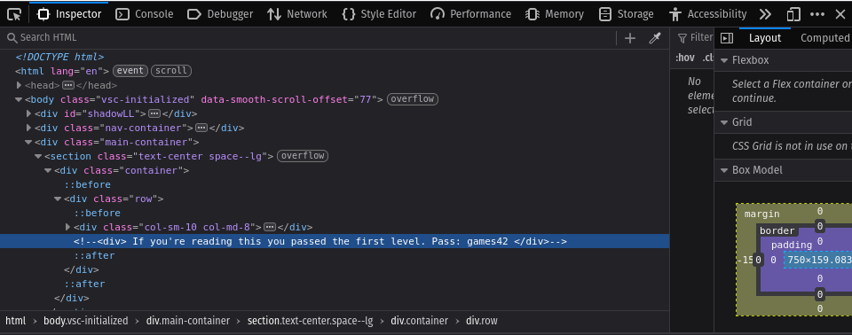
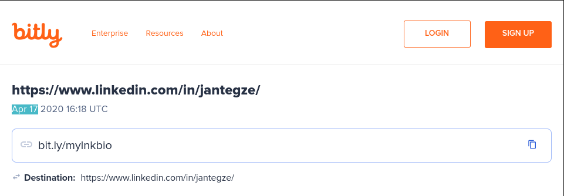
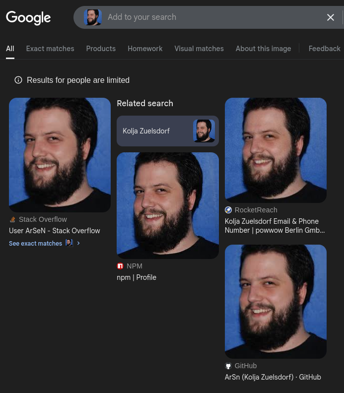
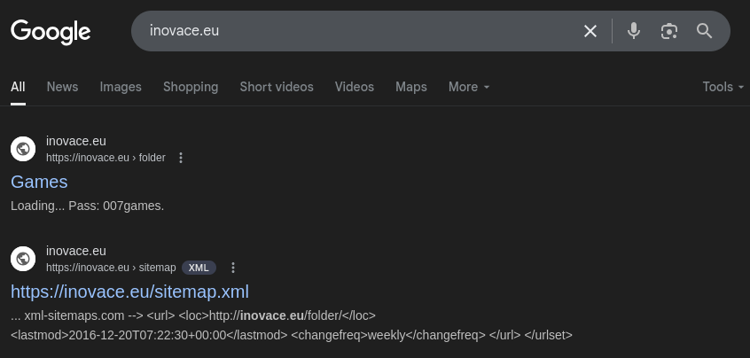

# Level 01

> Link: https://sourcing.games/game-1/game-1-xc4ya/

## Solution

1. Clicking the "Open Site" button redirects you to http://inovace.eu/game01/
2. View html of webpage
3. The password is located within `div.main-container > section.text-center.space--lg > div.container > div.row`

	

# Level 02

> Link: https://sourcing.games/game-1/game-1-csa7a/

## Solution

1. Use google image search on the image URL (https://sourcing.games/wp-content/uploads/2017/03/photo-203x300.jpg)
2. The person's image can be found here: https://harrypotter.fandom.com/wiki/Todd_Boyce
3. The password is his surname in lowercase: `boyce`

# Level 03

> Link: https://sourcing.games/game-1/game-1-h4xgm/

Find the date when this URL (shortener) was created.
Password is Month and Day (eg. “jan” and day “1”)
https://bit.ly/mylnkbio

## Solution:

Adding a "+" to the end of a bit.ly link provides statistics on the link

# Level 04

> Link: https://sourcing.games/game-1/game-1-wdd47k/

I met James Jones a few years ago, and he helped me with some things at recruitment.camp. To speed up our communication, I gave him an email at recruitment.camp.

However, I had to learn how to create a professional email address, especially since James didn’t want to have a dot in the email address.

His email is the password to the file below ([Download file](https://sourcing.games/wp-content/uploads/2024/04/james.docx)).

Hint: Don’t let bounce, disposable, spam-trap and deactivated emails decrease your sending reputation.

**Note:** _Do not contact James or the owner (me) of recruitment.camp via email or contact form on the site!  Be a sourcer, the **hint is enough.** Spamming will get your IP blocked._

## Solution:

1. Find professional email convention
2. Find typical work email at recruitment.camp via terms of service (e.g. support@recruitment.camp)
3. Trial and error: jamesj@recruitment.camp
4. Password is `sourcingfun`

# Level 05

> Link: https://sourcing.games/game-1/game-1-k1vs1/

Find the first name of this [StackOverflow user](https://meta.stackoverflow.com/users/5696502/arsen).

Password is the first name. (Example: John)

## Solution

1. Download image from stackoverflow profile
2. Search by images using google image search

3. Password is `Kolja`

# Level 06

> Link: https://sourcing.games/game-1/game-1-ku7xa/

One folder of this website “inovace.eu” was indexed by Google.

You can find there the password for the next level.

Use the password from the site

## Solution:

1. Enter URL in google search
2. 
3. Password is `007games`

# Level 7

> Link: https://sourcing.games/game-1/game-1-fs7ff/

This is the end of the game.
